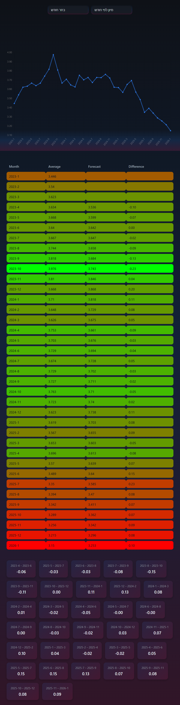

# Dollar Exchange Rate Platform

A full-stack analytics experience for exploring USD/ILS monthly exchange trends with clarity and speed.

This project combines a modern React interface, a FastAPI backend, and a persistent SQLite data layer to deliver an interactive dashboard with:
- historical monthly exchange-rate insights,
- visual trend analysis in a high-impact chart view,
- sortable tabular data exploration,
- and lightweight forecasting based on recent market behavior.

Built for reliability and developer velocity, the app runs end-to-end in Docker with reproducible local setup and a persistent database volume.

## Preview



## Stack

- Frontend: `React + Vite + Chart.js`
- Backend: `FastAPI`
- Database: `SQLite` (`database/exchange_rates.db`)
- Containerization: `Docker + Docker Compose`

## Project Structure

```text
.
|- client/                    # React application
|- server/                    # FastAPI service + DB logic
|  |- api/routes.py           # HTTP routes
|  |- db_access/              # connection, schema, seed, queries
|  '- services/               # validation + forecasts
|- database/
|  '- exchange_rates.db       # SQLite file
|- docker-compose.yml
|- Dockerfile.client
'- Dockerfile.server
```

## Quick Start (Docker)

Prerequisite:
- Docker Desktop installed and running

Run:

```bash
docker compose up --build
```

Services:
- Client: `http://localhost:5173`
- Server: `http://localhost:8000`

Stop:

```bash
docker compose down
```

## Environment Variables

### `client/.env`

```env
VITE_SERVER_URL="http://localhost:8000"
```

### `server/db_access/.env`

```env
API_KEY="YOUR_API_KEY"
BASE_URL="https://v6.exchangerate-api.com/v6/${API_KEY}/history/USD"
DB_PATH="/app/database/exchange_rates.db"
```

Docker volume mapping:
- `./database:/app/database`

This ensures the backend reads and writes to the project database file:
- `database/exchange_rates.db`

## API Endpoints

- `GET /all-rates`  
  Returns all records from `dollar_rate` as:
  `[[year, month, rate], ...]`

- `GET /{year}/{month}`  
  Returns the monthly rate for a specific year/month (or `null` if missing).

- `GET /forecasts`  
  Returns simple forecasts based on the average of the previous 3 months.

## Data Initialization Flow

When the server container starts:
1. `python /app/db_access/init_db.py` runs.
2. The `dollar_rate` table is created if it does not exist.
3. If the table is empty, historical seed data is generated and inserted.
4. `uvicorn` starts the API service.

## Local Run (Without Docker)

### Backend

```bash
cd server
pip install -r server_requirements.txt
python db_access/init_db.py
uvicorn main:app --reload --host 0.0.0.0 --port 8000
```

### Frontend

```bash
cd client
npm install
npm run dev
```

## Troubleshooting

- No data appears from the database:
  - Verify `DB_PATH` is `"/app/database/exchange_rates.db"` for Docker runs.
  - Verify `docker-compose.yml` contains:
    - `./database:/app/database`

- UI changes do not appear:
  - Try hard refresh: `Ctrl+F5`
  - Rebuild containers: `docker compose up --build`

- CORS issues:
  - Backend allows: `http://localhost:5173`
